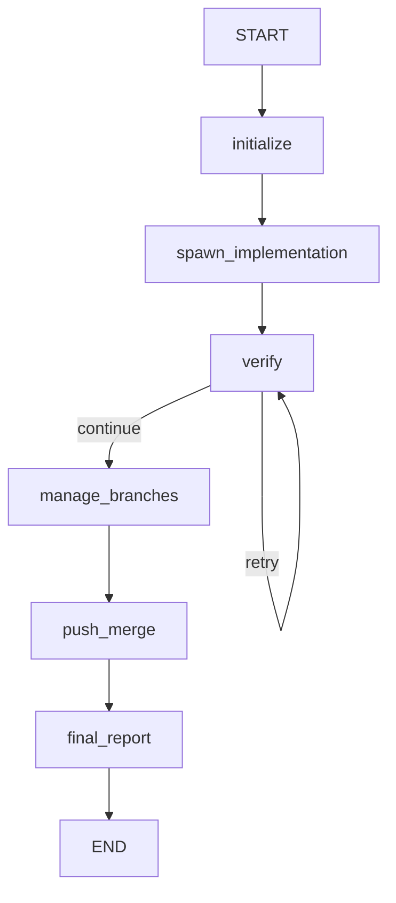

# LangGraph Sprint Executor

This plugin includes an **optional** LangGraph-based sprint executor that provides deterministic, resumable workflow orchestration.

## Why LangGraph?

The default `sprint-coordinator` agent uses prompt-based orchestration. LangGraph provides:

✅ **Deterministic execution** - State machine guarantees correct phase ordering
✅ **Resumability** - Can resume from any point if crash/interruption
✅ **Explicit feedback loops** - Verification retry logic is guaranteed
✅ **State inspection** - Can inspect workflow state at any node
✅ **Visualization** - Generate workflow diagrams
✅ **Better debugging** - See exactly where failures occur

## Architecture

### State Machine Phases

```
START
  ↓
[initialize]        Load jobs, detect repos
  ↓
[spawn_implementation]  Spawn agents in parallel
  ↓
[verify]           Run verification on completed jobs
  ↓  ↓
  │  └─→ (retry if failed, max 5 iterations)
  │      └─→ back to [verify]
  ↓
[manage_branches]  Update from main, resolve conflicts
  ↓
[push_merge]       Push + PR + auto-merge (or local merge)
  ↓
[final_report]     Generate execution report
  ↓
END
```

### State Structure

```python
class SprintState:
    # Input
    project_name: str
    sprint_prd_path: str
    todos_path: str
    pool_size: int

    # Jobs
    jobs: List[JobSpec]  # Full job specifications

    # Execution state
    phase: "init" | "implementing" | "verifying" | ...

    # Progress tracking
    jobs_verified: List[str]
    jobs_failed: List[str]

    # Error tracking
    errors: List[Dict]
```

## Installation

### 1. Install Python Dependencies

```bash
# Using the provided script
bash scripts/install_langgraph.sh

# Or manually
pip install --user langgraph langchain-anthropic
```

### 2. Set API Key

```bash
export ANTHROPIC_API_KEY="your-api-key"
```

### 3. Enable MCP Server

The LangGraph executor is registered as an MCP server in `plugin.json`:

```json
{
  "mcpServers": {
    "langgraph-sprint-executor": {
      "command": "python3",
      "args": ["${CLAUDE_PLUGIN_ROOT}/mcp-servers/langgraph_sprint_executor.py"]
    }
  }
}
```

## Usage

### Option 1: Use via MCP Tool (Recommended)

In `setup-jobs.md` Step 6, use the MCP tool instead of spawning coordinator agent:

```
mcp__langgraph-sprint-executor__execute_sprint(
  project_name="my-project",
  sprint_prd_path="thoughts/sprint-plans/my-project/2025-11-03_prd_*.md",
  todos_path="2025-11-03_todos.md",
  pool_size=3
)
```

### Option 2: Direct Python Execution

```bash
cd /path/to/project

python3 ~/.claude/plugins/local-dev/sprint-workflow/mcp-servers/langgraph_sprint_executor.py \
  --mode direct \
  --project my-project \
  --prd thoughts/sprint-plans/my-project/*_prd_*.md \
  --todos *_todos.md \
  --pool 3
```

## Features

### ✅ Parallel Execution

Jobs are executed truly in parallel (up to `pool_size`):

```python
async def spawn_implementation_agents(state: SprintState):
    # Batched parallel execution
    for batch in batched(pending_jobs, state['pool_size']):
        await asyncio.gather(*[
            implement_job(job) for job in batch
        ])
```

### ✅ Automatic Verification Loops

```python
def should_retry_or_continue(state: SprintState) -> "retry" | "continue":
    has_implementing = any(j['status'] == 'implementing' for j in state['jobs'])
    has_pending = any(j['status'] == 'pending' for j in state['jobs'])

    if has_implementing or has_pending:
        return "retry"  # Loop back to verify
    else:
        return "continue"  # Move to branch management
```

### ✅ State Persistence & Resumability

```python
# Checkpointing built-in
checkpointer = MemorySaver()
app = workflow.compile(checkpointer=checkpointer)

# Can resume from crash
config = {"configurable": {"thread_id": "sprint-my-project"}}
final_state = await app.ainvoke(initial_state, config)

# If crashes, just re-run with same thread_id
# It will resume from last checkpoint!
```

### ✅ Multi-Repo Awareness

```python
async def push_and_merge(state: SprintState):
    for repo in state['repos']:
        if repo['has_remote']:
            # Push + create PR + auto-merge
            await push_branch(job['branch'])
            await create_pr(job)
            await merge_pr(job)
        else:
            # Merge locally
            await merge_local(job['branch'])
```

### ✅ Non-Blocking Error Handling

```python
# Job fails verification after 5 retries
if job['retry_count'] >= 5:
    job['status'] = 'failed'
    error_file = write_error_report(job, details)
    state['errors'].append({'job': job['name'], 'report': error_file})

    # Notify user but DON'T pause sprint
    print(f"⚠️  Job failed: {job['name']}")
    print(f"📄 Error report: {error_file}")
    print("ℹ️  Sprint continues - other jobs proceeding")

    # Other jobs continue!
```

## Output Files

### sprint_status.md (Live Dashboard)

Updated every iteration:

```markdown
# Sprint Status - Live Dashboard
**Last Updated**: 2025-11-03T20:45:32

## Current Phase: VERIFYING

### Jobs Summary
- Total: 5
- Implementing: 2
- Verifying: 1
- Verified: 1
- Failed: 1

### Job Details
[✓] **auth-system** (verified)
[>] **api-endpoints** (verifying)
  - Retries: 2/5
[>] **dashboard-ui** (implementing)
[✗] **complex-feature** (failed)
  - Error: Max verification retries reached
```

### sprint_errors_{timestamp}_{job}.md

Detailed error report for each failed job:

```markdown
# Sprint Error Report: complex-feature

**Status**: failed
**Phase**: Verification
**Iterations Attempted**: 5

## Error Details
Tests failing:
- test_edge_case_1: Expected X, got Y
- test_integration: Connection timeout

## Job Specification
Path: tasks/2025-11-03_feat_complex-feature.md
Worktree: worktrees/feat-complex-feature
Branch: feat-complex-feature

## Next Steps for Manual Resolution
1. Check worktree: cd worktrees/feat-complex-feature
2. Run tests: npm test
3. Fix failures
4. Re-run verification
```

### sprint_report_{timestamp}.md

Final execution report:

```markdown
# Sprint Execution Report

## Overview
- Started: 2025-11-03T19:30:00
- Completed: 2025-11-03T20:45:32
- Total Jobs: 5

## Results
- ✅ Verified Complete: 4
- ⚠️ Failed: 1

### Story Points
- Total Planned: 45 points
- Delivered: 38 points
- Failed: 7 points
- Success Rate: 84%
```

## Visualization

You can visualize the workflow graph:

```python
from IPython.display import Image
from langgraph_sprint_executor import build_sprint_workflow

workflow = build_sprint_workflow()
app = workflow.compile()

# Generate diagram
Image(app.get_graph().draw_mermaid_png())
```

Output:



## Debugging

### Inspect State at Any Point

```python
# Get current state
state = app.get_state(config)
print(f"Current phase: {state['phase']}")
print(f"Jobs verified: {state['jobs_verified']}")
print(f"Jobs failed: {state['jobs_failed']}")
```

### View Execution History

```python
# Get all checkpoints
for checkpoint in app.get_state_history(config):
    print(f"Phase: {checkpoint.values['phase']}")
    print(f"Jobs: {len(checkpoint.values['jobs'])}")
```

## Comparison: Agent vs LangGraph

| Feature | sprint-coordinator (agent) | LangGraph Executor |
|---------|---------------------------|-------------------|
| Execution Order | Prompt-based (non-deterministic) | State machine (deterministic) |
| Resumability | None | Full (checkpoint-based) |
| Debugging | Read files, guess state | Inspect state graph directly |
| Verification Loops | Relies on agent following prompt | Guaranteed by conditional edges |
| Parallelization | Described in prompt | True async parallelization |
| State Tracking | File-based (fragile) | In-memory state (reliable) |
| Visualization | None | Generate workflow diagrams |
| Error Recovery | Undefined | Explicit error nodes |

## When to Use Which?

### Use Agent-Based (sprint-coordinator)
- ✅ Simple sprints (1-3 jobs)
- ✅ No complex error handling needed
- ✅ Want to stay in Claude Code ecosystem
- ✅ Prototyping/MVP

### Use LangGraph Executor
- ✅ Complex sprints (4+ jobs)
- ✅ Need reliability and resumability
- ✅ Want true parallel execution
- ✅ Need to debug/inspect state
- ✅ Production use

## Integration with setup-jobs

To use LangGraph executor, modify `commands/setup-jobs.md` Step 6:

**Before (Agent-based):**
```
Task: sprint-coordinator
Input:
  - Job specifications: tasks/*.md
  - Sprint PRD: {prd_file}
  - Worktrees: worktrees/feat-*/
```

**After (LangGraph):**
```
mcp__langgraph-sprint-executor__execute_sprint(
  project_name="{project}",
  sprint_prd_path="{prd_file}",
  todos_path="{todos_file}",
  pool_size=3
)
```

## Troubleshooting

### Dependencies not installed
```bash
pip install --user langgraph langchain-anthropic
```

### API key not set
```bash
export ANTHROPIC_API_KEY="sk-ant-..."
```

### MCP server not starting
Check logs in `~/.claude/logs/` for errors

### State not persisting
Ensure `thread_id` is consistent across invocations

## Next Steps

1. Install dependencies: `bash scripts/install_langgraph.sh`
2. Set API key: `export ANTHROPIC_API_KEY="..."`
3. Try it: Run `/setup-jobs` (will use LangGraph if available)
4. Monitor: Check `sprint_status.md` for live updates
5. Debug: Inspect state with Python if needed

## References

- [LangGraph Documentation](https://langchain-ai.github.io/langgraph/)
- [State Management](https://langchain-ai.github.io/langgraph/concepts/low_level/#state)
- [Checkpointing](https://langchain-ai.github.io/langgraph/concepts/low_level/#checkpointer)
