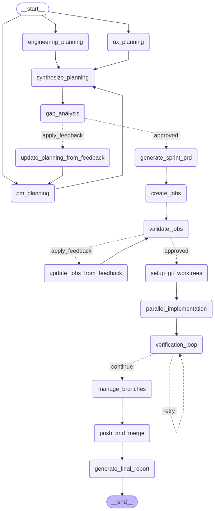

# Sprint Workflow

**Automated sprint execution with deterministic state machines.**

Transform a sprint theme into deployed code through parallel job execution, automatic verification, and merge orchestration—all managed by a LangGraph state machine that guarantees correct execution order and handles failures gracefully.

## The Problem

Sprint execution involves complex workflows: multi-perspective planning, architecture validation with feedback loops, job creation with code co-location analysis, parallel implementation, verification retries, and coordinated merging. Prompt-based orchestration fails at this complexity—agents skip steps, ignore feedback, or get stuck in loops.

## The Solution



LangGraph state machines provide:
- **Deterministic execution** - Every phase runs in the correct order
- **Guaranteed feedback loops** - Gap analysis and job validation with enforced retry limits
- **True parallelization** - Multiple jobs execute simultaneously in isolated git worktrees
- **Automatic recovery** - Resume from any point after crashes
- **Non-blocking failures** - Failed jobs don't stop the sprint

## How It Works

```bash
# 1. Plan your sprint (creates Sprint Brief)
/plan-sprint

# 2. Create Sprint PRD and launch execution
/create-sprint "User Authentication"
#    ✓ Multi-agent PRD generation (PM, UX, Engineering)
#    ✓ Architecture gap analysis
#    ✓ Todo generation
#    → Hands off to execution engine

# 3. Monitor progress
/sprint-status

# 4. Review results
/sprint-retrospective
```

## Quick Start

```bash
# Install dependencies
bash scripts/install_langgraph.sh
export ANTHROPIC_API_KEY="your-api-key"

# Run your first sprint
/plan-sprint  # Interactive planning to create Sprint Brief
/create-sprint "API Rate Limiting"  # Generate PRD and execute
```

## Key Features

| Feature | Description |
|---------|-------------|
| **Multi-agent planning** | PM, UX, and Engineering agents analyze requirements in parallel |
| **Gap analysis** | Validates architecture completeness with up to 3 feedback iterations |
| **Code co-location** | Groups related changes to minimize merge conflicts |
| **Parallel execution** | Runs multiple jobs simultaneously in isolated worktrees |
| **Verification loops** | Automatically retries failed jobs up to 5 times |
| **Non-blocking errors** | Continues sprint even when individual jobs fail |

## Commands

- `/plan-sprint` - Interactive planning session (REQUIRED - creates Sprint Brief)
- `/create-sprint` - Generate Sprint PRD from brief, then launch execution
- `/sprint-status` - Real-time progress dashboard
- `/sprint-retrospective` - Post-sprint metrics and analysis

## Architecture

The workflow has two phases:

### Phase 1: Planning (Claude Code Commands)
1. **Sprint Brief** - `/plan-sprint` creates initial brief through conversation
2. **PRD Generation** - `/create-sprint` invokes PM/UX/Engineering agents
3. **Gap Analysis** - Validates architecture completeness
4. **Todo Generation** - Creates task checklist

### Phase 2: Execution (Future LangGraph Implementation)
5. **Job Creation** - Analyzes code co-location and creates job specs
6. **Implementation** - Executes jobs in parallel worktrees
7. **Verification** - Tests and validates each job (max 5 retries per job)
8. **Integration** - Manages branches, creates PRs, and merges

See [LANGGRAPH.md](LANGGRAPH.md) for technical details, state schemas, and debugging tools.

## Documentation

- [LANGGRAPH.md](LANGGRAPH.md) - State machine architecture and technical reference
- [CLAUDE.md](CLAUDE.md) - Developer guide for contributing
- [docs/DIAGRAMS.md](docs/DIAGRAMS.md) - Workflow visualization

## Requirements

Python 3.9+ with LangGraph dependencies