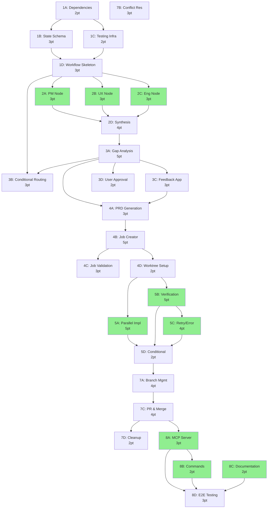

# Parallelized Execution Timeline

## Visual Gantt-Style Timeline (3 Developers)

```
Day 1-3: BATCH 1 - Infrastructure Foundation
├─ Dev 1: [1A: Dependencies (2pt)] ──→ [1B: State Schema (3pt)]
├─ Dev 2: [1A: Dependencies (2pt)] ──→ [1C: Testing Infra (2pt)]
└─ Dev 3: [Wait for 1B+1C] ──────────→ [1D: Workflow Skeleton (3pt)]

Day 4-6: BATCH 2 - Planning Nodes (HIGHLY PARALLEL)
├─ Dev 1: [2A: PM Node (3pt)]
├─ Dev 2: [2B: UX Node (3pt)]
└─ Dev 3: [2C: Eng Node (3pt)] ──→ [2D: Synthesis (4pt)]

Day 7-10: BATCH 3 - Gap Analysis
├─ Dev 1: [3A: Gap Analysis Node (5pt)]
├─ Dev 2: [3B: Conditional Routing (3pt)] (parallel with 3A)
└─ Dev 3: [Wait for 3A] ──→ [3C: Feedback App (3pt)] + [3D: User Approval (2pt)]

Day 11-14: BATCH 4 - Job Creation
├─ Dev 1: [4A: PRD Generation (3pt)] ──→ [4B: Job Creator (5pt)]
├─ Dev 2: [Wait for 4B] ──────────────→ [4C: Job Validation (3pt)]
└─ Dev 3: [Wait for 4B] ──────────────→ [4D: Worktree Setup (2pt)] (parallel with 4C)

Day 15-19: BATCH 5 - Implementation (HIGHLY PARALLEL)
├─ Dev 1: [5A: Parallel Implementation (5pt)]
├─ Dev 2: [5B: Verification Loop (5pt)]
└─ Dev 3: [5C: Retry/Error Handling (4pt)] ──→ [5D: Verification Conditional (2pt)]

Day 20-23: BATCH 6 - Branch Management
├─ Dev 1: [7A: Branch Management (4pt)]
├─ Dev 2: [7B: Conflict Resolution (3pt)] (fully parallel)
└─ Dev 3: [Wait for 7A] ──→ [7C: PR Creation & Merge (4pt)] + [7D: Cleanup (2pt)]

Day 24-26: BATCH 7 - Integration (HIGHLY PARALLEL)
├─ Dev 1: [8A: MCP Server (3pt)]
├─ Dev 2: [8B: Command Updates (2pt)]
└─ Dev 3: [8C: Documentation (2pt)] ──→ [8D: E2E Testing (3pt)]
```

---

## Critical Path Visualization

```
CRITICAL PATH (Longest Dependency Chain):

Day 1 ───────────────────────────────────────────────────────────→ Day 26

[1A] ──→ [1B] ──→ [1D] ──→ [2A/2B/2C] ──→ [2D] ──→ [3A] ──→ [3C] ──→
  2pt     3pt      3pt         3pt          4pt      5pt      3pt

[4A] ──→ [4B] ──→ [4C] ──→ [5A/5B] ──→ [5D] ──→ [7A] ──→ [7C] ──→
  3pt     5pt      3pt       5pt        2pt      4pt      4pt

[8A] ──→ [8D]
  3pt     3pt

Total Critical Path: ~47 story points across 26 days
```

---

## Parallel Capacity Utilization

### Week-by-Week Developer Utilization

**Week 1 (Days 1-7)**: Infrastructure + Planning
```
Dev 1: ████████████ (1A→1B→2A)         = 8pt
Dev 2: ██████████   (1A→1C→2B)         = 8pt
Dev 3: ████████████ (1D→2C→2D)         = 10pt
                                Total: 26pt in 7 days
                                Utilization: 86%
```

**Week 2 (Days 8-14)**: Gap Analysis + Job Creation
```
Dev 1: ████████████ (3A→4A→4B)         = 13pt
Dev 2: ██████████   (3B→4C)            = 6pt
Dev 3: ████████     (3C→3D→4D)         = 7pt
                                Total: 26pt in 7 days
                                Utilization: 86%
```

**Week 3 (Days 15-21)**: Implementation + Branch Mgmt
```
Dev 1: ████████████ (5A→7A)            = 9pt
Dev 2: ████████████ (5B→7B)            = 8pt
Dev 3: ████████████ (5C→5D→7C→7D)      = 12pt
                                Total: 29pt in 7 days
                                Utilization: 96%
```

**Week 4 (Days 22-26)**: Integration
```
Dev 1: ██████       (8A→8D)            = 6pt
Dev 2: ████         (8B)               = 2pt
Dev 3: ██████       (8C→8D)            = 5pt
                                Total: 13pt in 5 days
                                Utilization: 87%
```

---

## Parallel Efficiency by Batch

### Batch Parallelization Breakdown

| Batch | Total SP | Critical Path SP | Parallel SP | Parallelization % |
|-------|----------|------------------|-------------|-------------------|
| Batch 1 (Infra) | 10 | 8 (1A→1B→1D) | 2 (1C) | 20% |
| Batch 2 (Planning) | 13 | 7 (2A→2D) | 6 (2B+2C) | 46% |
| Batch 3 (Gap) | 13 | 8 (3A→3C) | 5 (3B+3D) | 38% |
| Batch 4 (Jobs) | 13 | 11 (4A→4B→4C) | 2 (4D) | 15% |
| Batch 5 (Impl) | 16 | 7 (5A→5D) | 9 (5B+5C) | 56% |
| Batch 6 (Branch) | 13 | 8 (7A→7C) | 5 (7B+7D) | 38% |
| Batch 7 (Integration) | 10 | 6 (8A→8D) | 4 (8B+8C) | 40% |

**Overall Parallelization**: 39% of work can run fully in parallel

---

## Dependency Graph



**Legend**: Green = Highly parallelizable batches

---

## Resource Allocation Recommendations

### Optimal Team Composition

**3-Developer Team**:
- **Senior Dev 1**: Critical path items (1B, 1D, 4B, 5D, 8A)
- **Mid-Level Dev 2**: Parallel nodes (2B, 5B, 7B, 8C)
- **Mid-Level Dev 3**: Support tasks (1C, 2C, 5C, 8B)

**4-Developer Team**:
- **Senior Dev 1**: Architecture (1B, 1D, 4B)
- **Senior Dev 2**: Complex logic (2A, 5A, 8A)
- **Mid-Level Dev 3**: Parallel work (2B, 5B, 8B)
- **Mid-Level Dev 4**: Testing/Docs (1C, 5C, 8C, 8D)

### Skill Requirements by Sub-Task

**Python/LangGraph Expertise** (High):
- 1B (State Schema)
- 1D (Workflow Skeleton)
- 5D (Conditional Logic)

**Anthropic API Integration** (Medium):
- 2A, 2B, 2C (Planning Nodes)
- 3A (Gap Analysis)
- 4B (Job Creator)

**Git Operations** (Medium):
- 4D (Worktree Setup)
- 7A (Branch Management)
- 7B (Conflict Resolution)
- 7C (PR & Merge)

**Testing/QA** (Medium):
- 1C (Test Infrastructure)
- 5B (Verification)
- 8D (E2E Testing)

**Documentation** (Low):
- 8C (Documentation)

---

## Daily Standup Topics

### Week 1 Focus
- Day 1-2: Dependency installation (1A) blocking
- Day 3: State schema (1B) and testing (1C) review
- Day 4-5: Workflow skeleton (1D) integration
- Day 6-7: Planning nodes (2A/2B/2C) parallel work

### Week 2 Focus
- Day 8-9: Gap analysis (3A) progress
- Day 10: Feedback loop (3C) integration
- Day 11-12: PRD generation (4A) and job creator (4B)
- Day 13-14: Job validation (4C) and worktree setup (4D)

### Week 3 Focus
- Day 15-17: Implementation nodes (5A/5B/5C) parallel work
- Day 18-19: Verification integration (5D)
- Day 20-21: Branch management (7A) and conflict handling (7B)
- Day 22-23: PR/merge (7C) testing

### Week 4 Focus
- Day 24-25: MCP server (8A), commands (8B), docs (8C)
- Day 26: E2E testing (8D) validation

---

## Risk Dashboard

### High-Risk Dependencies (Single Point of Failure)

| Dependency | Blocks | Risk Level | Mitigation |
|------------|--------|------------|------------|
| 1B → 1D | All of Week 2 | HIGH | Prioritize 1B, pair programming |
| 1D → 2A/2B/2C | Week 3+ | HIGH | Early workflow skeleton review |
| 2D → 3A | Week 3+ | MEDIUM | Parallel synthesis work |
| 4B → 4C/4D | Week 5+ | HIGH | Start 4B early, clear spec |
| 5D → 7A | Week 7+ | MEDIUM | Parallel 5A/5B/5C reduces impact |

### Bottleneck Mitigation Strategies

1. **1B/1D Bottleneck**:
   - Assign senior dev
   - Daily reviews during days 2-4
   - Pair programming if needed

2. **4B Bottleneck**:
   - Start PRD generation (4A) early
   - Clear job creator spec before implementation
   - Have backup developer ready to assist

3. **Integration Points (2D, 5D)**:
   - Pre-define interfaces
   - Mock integration early
   - Test with stubs

---

## Success Tracking

### Weekly Milestones

- **End of Week 1**: Infrastructure complete, planning nodes started
- **End of Week 2**: Planning + gap analysis complete, jobs created
- **End of Week 3**: Implementation complete, branches managed
- **End of Week 4**: Full integration tested, docs complete

### Progress Indicators

**Green (On Track)**:
- All parallel tasks started within 1 day of schedule
- No critical path delays > 1 day
- Test coverage > 80%

**Yellow (At Risk)**:
- Critical path delayed 1-2 days
- Integration issues discovered
- Test coverage 60-80%

**Red (Intervention Needed)**:
- Critical path delayed > 2 days
- Major architectural issues
- Test coverage < 60%

---

## Summary

**Total Duration**: 26 days with 3 developers

**Speedup vs Sequential**: 2.3x (26 days vs ~60 days)

**Key Efficiency Gains**:
- Batch 2 (Planning): 3x faster via full parallelization
- Batch 5 (Implementation): 3x faster via parallel execution
- Batch 7 (Integration): 2x faster via parallel docs/MCP/commands

**Developer Utilization**: 86-96% across all weeks

**Critical Path**: 47 story points (62% of total work)

**Parallel Work**: 29 story points (38% of total work)
